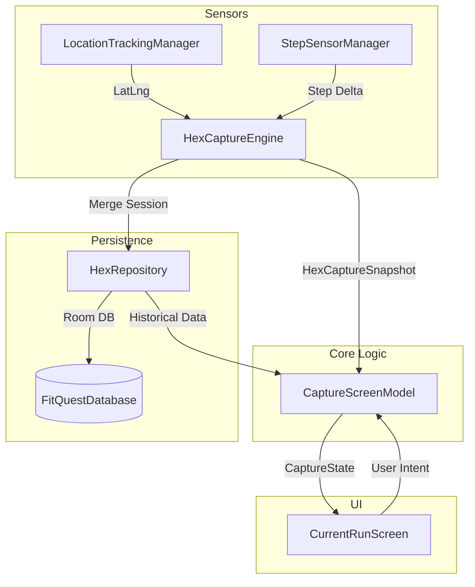

# Architecture Overview

FitQuest is built using modern Android development practices, emphasizing a reactive, state-driven UI and a clear separation of concerns.

## Architectural Patterns

### MVI (Model-View-Intent)
The app uses the **MVI** pattern to manage UI state, implemented via the [Orbit MVI](https://orbit-mvi.org/) library.

- **State**: A single source of truth for the UI (e.g., `CaptureState`).
- **Intents**: User or system actions that trigger state changes (e.g., `onToggleTracking`).
- **Side Effects**: One-off events (like navigation or showing a snackbar) that don't directly modify the state.

This ensures that the UI is predictable and easy to test, as every change is driven by a discrete intent and results in a new immutable state snapshot.

### Voyager & ScreenModel
Navigation and ViewModel-like logic are handled by [Voyager](https://voyager.adriel.cafe/).

- **Screens**: Defined as discrete Compose components.
- **ScreenModel**: Replaces the traditional Android `ViewModel`. The `CaptureScreenModel` manages the `HexCaptureEngine` and maps its snapshots into the `CaptureState`.

## Dependency Injection
[Koin](https://insert-koin.io/) is used for dependency injection, configured in [AppModule.kt](file:///home/divesh/Desktop/projects/fitquest/apps/app/fitquest/src/main/java/com/example/mobileapp/di/AppModule.kt).

Koin manages the lifecycle of:
- **Singletons**: `FitQuestDatabase`, `HexIndexer`, `HexRepository`, `HexCaptureEngine`.
- **Managers**: `LocationTrackingManager`, `StepSensorManager`.
- **Factory**: `CaptureScreenModel`.

## Reactive Streams (Coroutines & Flow)
The application relies heavily on **Kotlin Coroutines and Flow** for asynchronous data handling:
- **Sensor Data**: Location updates and step deltas are emitted as cold flows.
- **Engine State**: Managed as a `StateFlow` within the `HexCaptureEngine`.
- **Persistence**: Room returns `Flow` for reactive database queries.

## Data Flow Diagram

